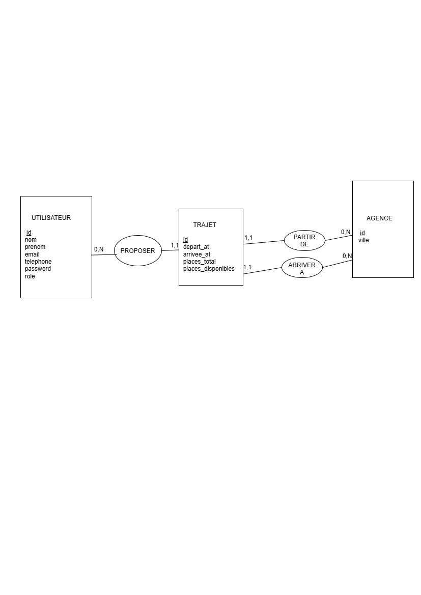

# Touche pas au Klaxon 

## Présentation

**Touche pas au Klaxon** est une application web intranet de covoiturage inter-sites destinée aux employés d'une entreprise.

Elle permet aux utilisateurs de consulter les trajets disponibles entre différentes agences, de proposer leurs propres trajets et de gérer les trajets qu'ils ont créés.

L'application dispose également d'un espace administrateur permettant de gérer les agences, de consulter les utilisateurs et de gérer les trajets proposés.

## Technologies utilisées

- PHP 8
- MySQL / MariaDB
- Architecture MVC
- Buki Router
- Bootstrap
- Sass
- Composer
- PHPStan
- PHPUnit
- Git / GitHub

## Installation

### Prérequis

Avant d'installer l'application, assurez-vous de disposer de :

- PHP 8 ou supérieur
- MySQL / MariaDB
- Composer
- Node.js et npm
- XAMPP ou un environnement équivalent
- Git

### Installation du projet

1. Cloner le dépôt GitHub :

```bash
git clone https://github.com/KayaNC988/TouchePasAuKlaxon.git 

2. Se placer dans le dossier du projet :

```bash
cd TouchePasAuKlaxon
```

3. Installer les dépendances PHP :

```bash
composer install
```

4. Installer les dépendances Node.js :

```bash
npm install
```

5. Compiler les fichiers Sass:

```bash
npm run sass
```

6. Créer la base de données MySQL/MariaDB puis importer le fichier :

```text
database/schema.sql
```

7. Importer ensuite le jeu de données :

```text
database/seed.sql
```

8. Vérifier les paramètres de connexion à la base de données dans :

```text
config/database.php
```

9. Lancer l'application :

```bash
php -S localhost:3000 -t public
```

10. Ouvrir l'application dans le navigateur à l'adresse :

```text
http://localhost:3000
```

## Utilisation

### Compte utilisateur

Un utilisateur connecté peut :

- consulter les trajets disponibles ;
- consulter les détails d'un trajet ;
- proposer un nouveau trajet ;
- modifier ses propres trajets ;
- supprimer ses propres trajets.

### Compte administrateur

L'administrateur dispose d'un espace dédié permettant de :

- consulter la liste des utilisateurs ;
- consulter la liste des agences ;
- créer, modifier et supprimer une agence ;
- consulter la liste des trajets ;
- supprimer un trajet.

## Identifiants de connexion

les comptes suivants peuvent être utilisés pour tester l'application.

### Utilisateur

- Email : 'alexandre.martin@email.fr'
- Mot de passe : 'klaxon2026'

### Administrateur

- Email : 'admin@klaxon.fr'
- Mot de passe : 'klaxon2026'

## Tests et qualité du code 

### Analyse statique avec PHPStan

L'analyse statique du code peut être lancée avec la commande :

```bash
.\vendor\bin\phpstan.bat analyse app
```

### Tests unitaires avec PHPUnit 

Les tests PHPUnit vérifient notamment les opérations d'écritures en base de données.

Pour lancer les tests :

```bash
.\vendor\bin\phpunit.bat tests/TrajetTest.php
```

Les tests sont exécutés dans une transaction qui est annulée après chaque test afin de ne pas modifier les données de l'application.

# Modèle conceptuel de données

Le modèle conceptuel de données (MCD) de l'application est présenté ci-dessous :



# Modèle Logique de Données — Touche pas au Klaxon

## AGENCES

AGENCES(
    #id,
    ville
)

## USERS

USERS(
    #id,
    nom,
    prenom,
    email,
    telephone,
    password,
    role
)

## TRAJETS

TRAJETS(
    #id,
    agence_depart_id,
    agence_arrivee_id,
    depart_at,
    arrivee_at,
    places_total,
    places_disponibles,
    auteur_id
)

### Clés étrangères

- 'agence_depart_id' -> AGENCES(id)
- 'agence_arrivee_id' -> AGENCES(id)
- 'auteur_id' -> USERS(id)

